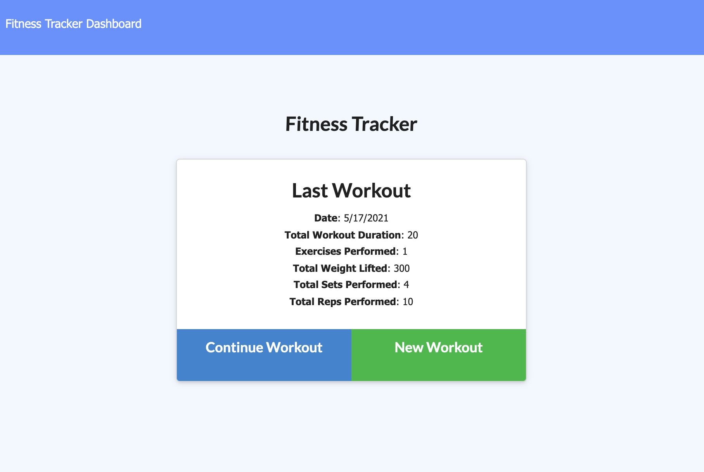

# Fitness Tracker

## Table of Contents

* Description
* Installation
* Usage
* Contributions
* Licensing
* Demo
* Questions

## Description

This is a deployed application which utilizes a Mongo database with Mongoose schema in order to chart and graph user records of workouts to visualize the progress of their gym routines.

## Installation

Users may visit the deployed application at: https://wellnesstracker.herokuapp.com/

## Usage

Users are able to view create and track daily workouts, by tracking the name, type, weight, sets, reps, and duration of exercises.

## Contributions

No contributers involved with this project.

## Licensing

## Demo

## Questions

* You can follow my repositories at https://www.github.com/jarretebarnett
* For professional inquiries, you can email jarretebarnett@gmail.com